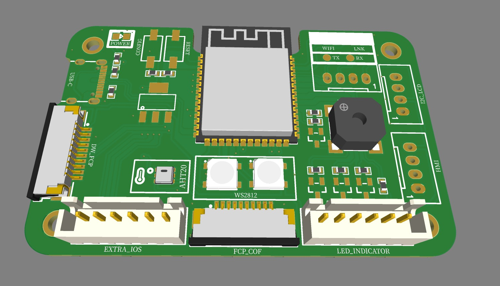

# ESP32-S3 Open-Source Development Board  

  

## Overview  
This is a **pocket-friendly, open-source ESP32-S3 development board** designed for **IoT, embedded systems, and prototyping**. It features **USB Type-C power input**, onboard **WS2812B RGB LEDs**, an **AHT20 temperature & humidity sensor**, and **multiple expansion interfaces** for external peripherals like **DWIN LCDs** and **I2C displays**.  

## Features  

### 🛠️ Hardware Specifications  
- **ESP32-S3 MCU** – **Dual-core processor** with **Wi-Fi 4 & Bluetooth 5.0** support.  
- **USB Type-C Power Supply** – Efficient and modern power input.  
- **WS2812B RGB LEDs (x2)** – Addressable LEDs for status indication and testing.  
- **AHT20 Temperature & Humidity Sensor** – Connected via **I2C** for environmental monitoring.  
- **Exposed UART & I2C Ports** – Supports **DWIN serial displays**, **16x2 I2C LCDs**, and additional sensors.  
- **10-Pin FPC Connector** – Allows **DWIN LCDs & COF LCDs** integration.  
- **Common Anode RGB Switch Indicator Pins** – Connect RGB buttons for user input.  
- **Onboard Status LEDs**:  
  - **Power LED** – Indicates the board is powered on.  
  - **Wi-Fi LED** – Shows network connectivity.  
  - **Link Status LED** – Displays communication status.  

## 🖥️ Applications  
- 🔹 **IoT & Smart Home Automation** – Wireless connectivity with sensors & devices.  
- 🔹 **Industrial Monitoring** – Real-time environmental data collection.  
- 🔹 **Embedded UI Projects** – Seamless connection with **DWIN LCDs** for user interfaces.  
- 🔹 **Prototyping & Testing** – Experiment with **ESP32-S3** features in various applications.  

## 🛠️ Getting Started  

### 📌 Prerequisites  
- Install **ESP-IDF** or **Arduino IDE** for firmware development.  
- Ensure **USB Type-C** cable is connected for power and programming.  

### 📥 Clone This Repository  
```bash
git clone https://github.com/Tejeet/ESP32-S3_Pocket_Dev_Board.git
cd ESP32-S3_Pocket_Dev_Board
